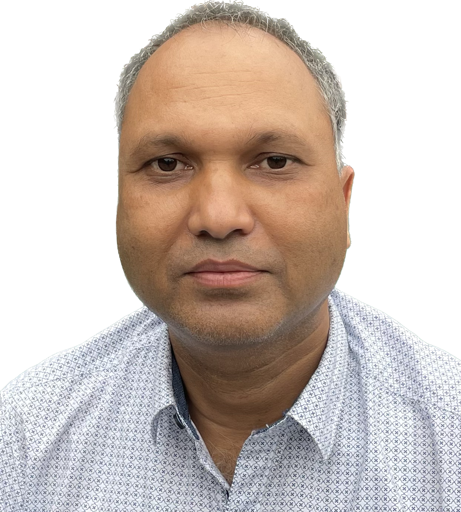

  

## **Dr. Rustam Ali Ahmed, Ph.D.**

Barpeta Road, Assam – 781315, India
📞 +91 7002453818
📧 [ahmed.rustam77@gmail.com](mailto:ahmed.rustam77@gmail.com)
🔗 LinkedIn: [https://www.linkedin.com/in/dr-rustam-ahmed-61938949](https://www.linkedin.com/in/dr-rustam-ahmed-61938949)
🔗 GitHub: [https://github.com/rustamtu](https://github.com/rustamtu)

---

## **1. RESEARCH PROFILE / SUMMARY**

Experienced Computer Science academician with over **19 years of teaching, research, and academic leadership**. Specializing in **Artificial Intelligence, medical image analysis, and cloud-based systems**, with significant contributions to institutional digital transformation. Proven track record in **Ph.D. supervision, research publications, and development of large-scale academic platforms**, including examination and student information systems.

---

## **2. RESEARCH INTERESTS**

* Artificial Intelligence & Machine Learning
* Medical Image Analysis & Biometrics
* Cloud Computing & Distributed Systems
* Data Analytics & Smart Systems

---

## **3. EDUCATION**

* **Ph.D., Computer Science & Engineering**, Tezpur University, 2018
* **M.Tech., Information Technology**, Tezpur University, 2005
* **M.Sc., Mathematics**, Tezpur University, 2003
* **PGDCA**, Gauhati University, 2001
* **B.Sc. (Hons), Mathematics**, Gauhati University, 1998

---

## **4. ACADEMIC EXPERIENCE**

### **Sikkim Manipal Institute of Technology (SMIT), India**

* **Assistant Professor (Selection Grade)** | Feb 2020 – Jul 2025
* **Assistant Professor-I** | Oct 2017 – Jan 2020
* **Lecturer / Assistant Professor-II** | Oct 2005 – Oct 2017

**Total Teaching Experience:** 19+ Years

**Courses Taught:**

* Programming (C, C++, Java, Python)
* Data Structures & Algorithms
* Computer Graphics
* Web Technologies
* Cyber Security
* Cloud Computing
* Finite Automata & Numerical Techniques

---

## **5. INDUSTRY EXPERIENCE**

### **Director**

**RWorld Computer Solutions (OPC) Pvt. Ltd.**

* Leading software architecture, cloud deployment, and institutional consultancy
* Developed scalable platforms for academic institutions and enterprises
* Delivered systems for admissions, examinations, LMS, and student information systems

---

## **6. RESEARCH SUPERVISION**

* Supervising **1 Ph.D. Scholar (Ongoing)**

  * **Ashis Datta**
    *Computer-Aided Prediction of Brain-Related Diseases using Radiology Images*
    (Thesis under submission)

**Research Focus:** AI-based medical image analysis (MRI, Alzheimer’s, Glioma)
**Outcome:** Publications in Springer-indexed conferences and ongoing SCI journal submission

---

## **7. RESEARCH PROJECTS**

* **Mobile Application for SMIT Campus (Principal Investigator)**
  Developed an integrated platform for academic and administrative services

* **Orographic Rainfall Prediction for Landslide Warning (Co-PI)**
  AI-based early warning system using Doppler Weather Radar (DWR) data

---

## **8. PUBLICATIONS**

### **Journal Publications**

1. **Rustam Ali Ahmed**, Bhogeswar Borah,
   “Triangle Wise Mapping Technique to Transform One Face Image into Another Face Image,”
   *International Journal of Computer Applications*, 2014.

2. **Rustam Ali Ahmed**, Bhogeswar Borah,
   “An Iterative Search-Based Technique to Predict Older Face Images of a Child,”
   *International Journal of Computer Applications*, 2016.

3. Shubhraleena Chowdhury, **Rustam Ali Ahmed**, et al.,
   “Impact of Internet Technologies in Medical Science,” 2015.

4. Shrija Sanjana, **Rustam Ali Ahmed**, et al.,
   “Comparative Study on Iris Recognition Systems,” 2016.

5. Pritikana Sen, **Rustam Ali Ahmed**, et al.,
   “E-Commerce Security Issues and Solutions,” 2015.

---

### **Conference / Book Chapters (Indexed)**

6. **Rustam Ali Ahmed**, et al.,
   “HIMIC: Hierarchical Mixed-Type Data Clustering,” Springer.

7. Ashis Datta, **Rustam Ali Ahmed**, et al.,
   “PIRNet: Deep Neural Network for Brain MRI Segmentation,” ASCIS 2024.

8. Ashis Datta, **Rustam Ali Ahmed**, et al.,
   “Alzheimer Disease Detection using MobileNetV2 + Vision Transformer,” ICMEET 2024.

9. Ashis Datta, **Rustam Ali Ahmed**, et al.,
   “Brain Glioma Segmentation using Cascaded mLinkNet,” ICDSC 2024.

10. Ashis Datta, **Rustam Ali Ahmed**, et al.,
    “SLesionNet: Transformer-Based Stroke Lesion Segmentation,”
    *(SCI Journal – Under Review, 2026)*

---

## **9. ACADEMIC LEADERSHIP & ADMINISTRATION**

* Head, IT Council – Led institutional IT strategy and digital transformation
* Chairman, Software Development Teams – Delivered university-wide systems
* Member, Admission Committees
* Departmental Coordinator & Lab In-charge
* Major Project & Budget Coordinator

---

## **10. KEY PROJECTS & CONSULTANCY**

* Online Proctored Examination System (5000+ users during COVID-19)
* Online Admission System (end-to-end university admissions)
* Learning Management System (LMS)
* Student Information System & Mobile Applications
* E-commerce and API-based platforms

---

## **11. COURSE DEVELOPMENT**

* Designed curriculum for Data Structures, Cloud Computing, and Cyber Security
* Developed lab modules and project-based learning frameworks

---

## **12. TECHNICAL SKILLS**

* **Programming:** Python, Java, C, C++, PHP, JavaScript, MATLAB
* **Frameworks:** Django, Laravel, CodeIgniter, React Native, Next.js
* **Cloud:** AWS, Azure, GCP
* **DevOps:** Docker, Kubernetes, GitHub Actions
* **Systems:** Linux, Apache, Nginx

---

## **13. AWARDS & RECOGNITION**

* Dr. T.M.A. Pai Overall Excellence Award (2020)
* Best Employee Award (SMIT, 2020)
* Finalist, National Awards for e-Governance (Govt. of India, 2020–21)

---

## **14. LANGUAGES**

Assamese | English | Hindi | Bengali

---

## **15. REFERENCES**

- Dr. Hiren Kumar Deva Sarma  
  Professor, Department of IT  
  Gauhati University, Guwahati, India  
  Email: hirenkdsarma@gauhati.ac.in  

- Dr. Biswaraj Sen  
  Professor & Head, Department of IT  
  Sikkim Manipal Institute of Technology, India  
  Email: biswaraj.s@smit.smu.edu.in  

- Dr. Udayan Baruah  
  Controller of Examinations & Registrar (Academic)  
  Birangana Sati Sadhani Rajyik Vishwavidyalaya, Assam, India  
  Email: udayan.baruah10@gmail.com  

